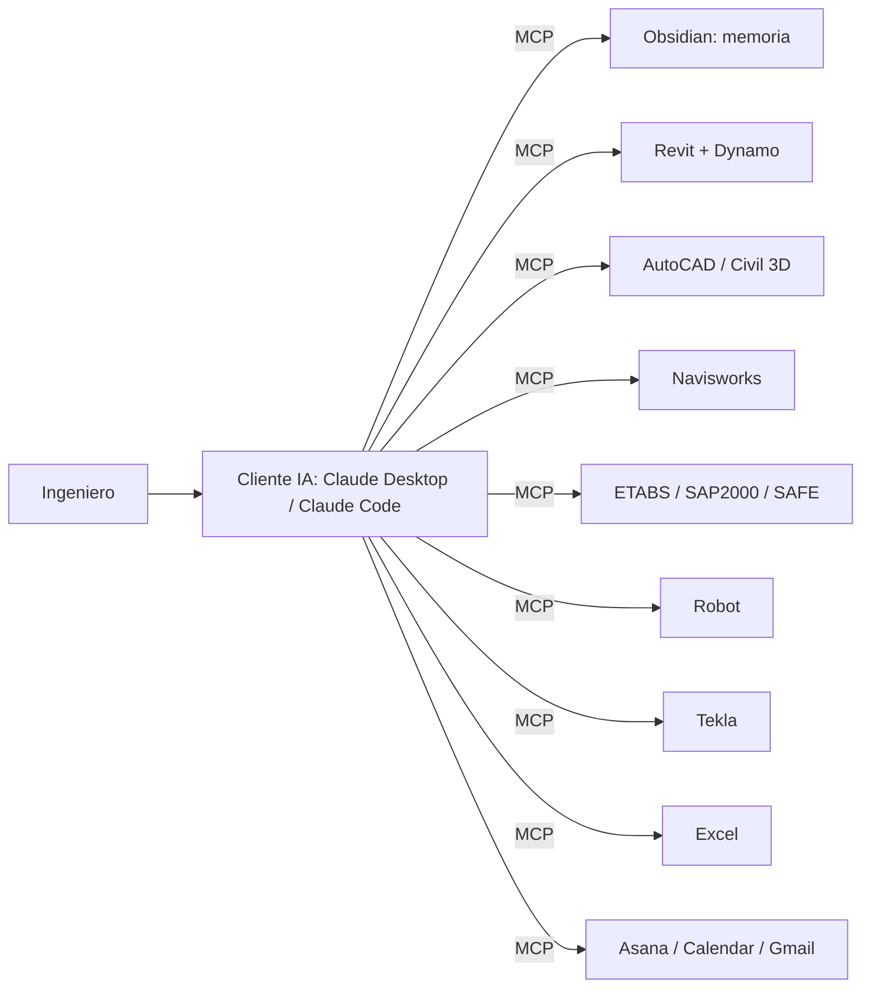

# 🟣 MOC — JARVIS y MCP

## Visión y diseño
- [[JARVIS - Vision y alcance]] · [[JARVIS - Arquitectura]] · [[JARVIS - Stack tecnologico]]
- [[Hoja de ruta JARVIS]]

## Protocolo
- [[MCP - Fundamentos]] · [[Patrones de puente MCP para software de escritorio]] · [[Configuracion de clientes MCP]]

## Servidores MCP por herramienta
- BIM/CAD: [[MCP Revit]] · [[MCP Dynamo]] · [[MCP AutoCAD y Civil 3D]] · [[MCP Navisworks]] · [[MCP Tekla Structures]]
- Estructural: [[MCP CSI - ETABS SAP2000 SAFE]] · [[MCP Robot Structural Analysis]]
- Datos: [[MCP Excel]] · [[MCP Obsidian - Memoria de JARVIS]]
- ⭐ Propio: [[MCP JARVIS BIM - Servidor propio]] (E.030-2026, bóveda, IFC, ISO 19650, ETABS)
- Gestión: [[MCP Gestion de Proyectos]]

## Inteligencia
- [[JARVIS - Agentes especializados]] · [[JARVIS - Flujos de trabajo]] · [[JARVIS - Biblioteca de prompts]]
- [[Red neuronal de conocimiento]] · [[Activar la red neuronal - Smart Connections]] · [[IA y Machine Learning en AEC]]

## Confianza
- [[JARVIS - Seguridad y gobernanza]] · [[JARVIS - Pruebas y evaluacion]]
- Base normativa de seguridad: [[ISO 19650-5 - Seguridad de la informacion]]

