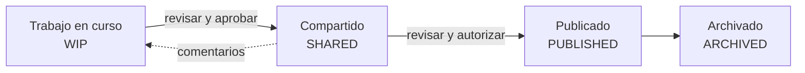

# CDE — Entorno Común de Datos

Fuente de información acordada para un proyecto o activo, para **recopilar, gestionar y difundir** cada contenedor de información mediante un **proceso gestionado** (ISO 19650-1).

## Los 4 estados

| Estado | Quién lo ve | Uso |
|---|---|---|
| **WIP** | Solo el equipo de tarea | Producción |
| **Compartido** | Otros equipos de tarea | Coordinación (no para construir) |
| **Publicado** | Parte que designa / obra | Uso autorizado (construcción, licitación) |
| **Archivado** | Registro | Trazabilidad, auditoría |

## Metadatos obligatorios de cada contenedor
- Código de **estado/idoneidad** (S0–S7, A, B, CR) → [[Codigos de estado e idoneidad]]
- **Revisión** (P01.01, C01…)
- **Clasificación** → [[Sistemas de clasificacion]]
- **Nombre** único → [[Nomenclatura de archivos y contenedores]]

## Plataformas
Autodesk Construction Cloud / BIM 360 ([[Autodesk Platform Services y ACC]]), Trimble Connect, Bentley ProjectWise, Aconex, Dalux, Viewpoint, Thinkproject, BIMcollab (issues), y soluciones abiertas (SharePoint con metadatos + BCF). En Perú la RD 0007-2025-EF/63.01 incluye una nota técnica sobre características de software, hardware y CDE → [[Plan BIM Peru]].

## Seguridad
Accesos por rol y clasificación de sensibilidad → [[ISO 19650-5 - Seguridad de la informacion]].

## JARVIS
Puede auditar el CDE: nombres no conformes, contenedores sin estado, revisiones duplicadas ([[JARVIS - Flujos de trabajo]]).

↑ [[MOC Metodologia BIM]] · [[ISO 19650-1 - Conceptos y principios]]
