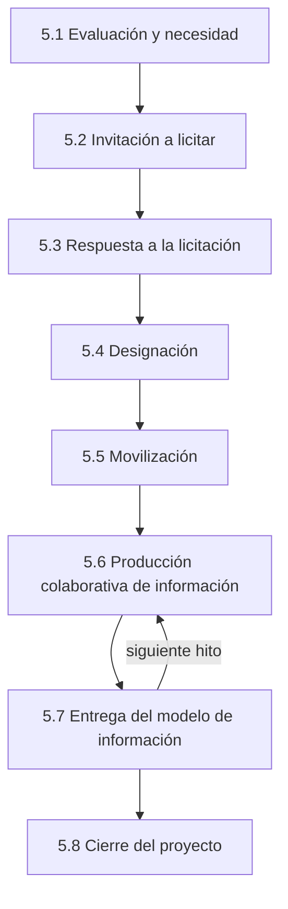

# Proceso de gestión de la información (ISO 19650-2)

Ocho actividades (cláusulas 5.1–5.8) durante la fase de desarrollo:

| # | Actividad | Entregables clave |
|---|---|---|
| 5.1 | Evaluación y necesidad | Designar responsables de gestión de información, PIR, hitos, estándar de información del proyecto, métodos de producción, información de referencia, CDE, **protocolo de información** |
| 5.2 | Invitación a licitar | **EIR** por parte designada, requisitos de respuesta, criterios de evaluación → [[EIR - Requisitos de Intercambio de Informacion]] |
| 5.3 | Respuesta | **BEP pre-designación**, evaluación de capacidad y capacidad, plan de movilización, registro de riesgos → [[BEP - Plan de Ejecucion BIM]] |
| 5.4 | Designación | BEP confirmado, matriz detallada, EIR de la parte principal a sus designadas, **TIDP/MIDP** → [[MIDP y TIDP - Planes de entrega]] |
| 5.5 | Movilización | Recursos, TI, pruebas del CDE y de intercambio de información |
| 5.6 | Producción colaborativa | Información en [[CDE - Entorno Comun de Datos]], revisiones de calidad, coordinación → [[Coordinacion BIM y deteccion de interferencias]] |
| 5.7 | Entrega | Revisión y autorización por la parte principal; aceptación por la parte que designa |
| 5.8 | Cierre | Archivo del PIM, lecciones aprendidas, traspaso al AIM → [[ISO 19650-3 - Fase operativa]] |

Norma: [[ISO 19650-2 - Fase de desarrollo]] · Perú: [[Guia Nacional BIM Peru]]

↑ [[MOC Metodologia BIM]]
