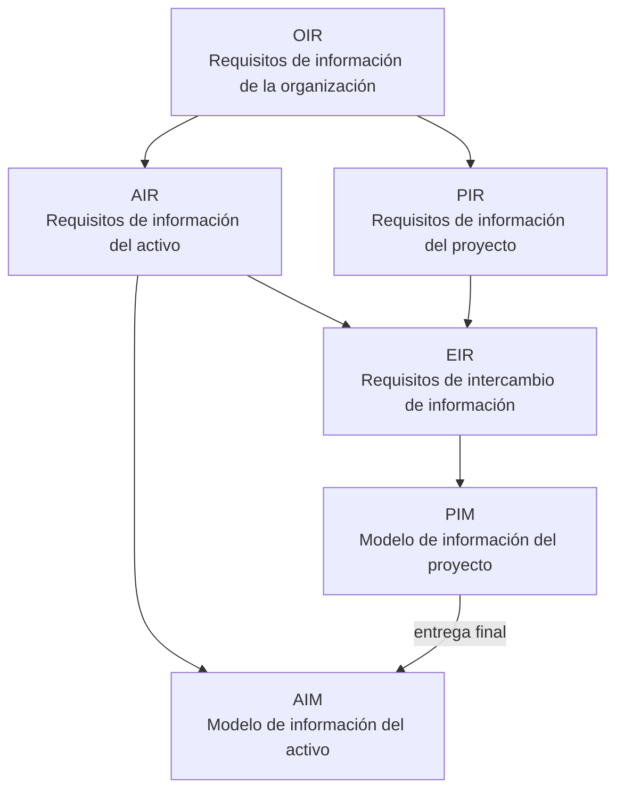

# Requisitos de información: OIR → AIR / PIR → EIR

| Sigla | Pregunta que responde | Quién la define |
|---|---|---|
| **OIR** | ¿Qué información necesita la organización para sus objetivos estratégicos? | Propietario (alta dirección) |
| **AIR** | ¿Qué información necesita para operar/mantener el activo? | Propietario (operación) |
| **PIR** | ¿Qué información necesita para tomar decisiones en los hitos del proyecto? | Propietario (gestión del proyecto) |
| **EIR** | ¿Qué debe entregar exactamente cada parte designada, cuándo y en qué formato? | Parte que designa → a cada parte designada |

Detalle: [[EIR - Requisitos de Intercambio de Informacion]] · Modelos: PIM ([[ISO 19650-2 - Fase de desarrollo]]), AIM ([[ISO 19650-3 - Fase operativa]]).

↑ [[Proceso de gestion de la informacion ISO 19650]]
