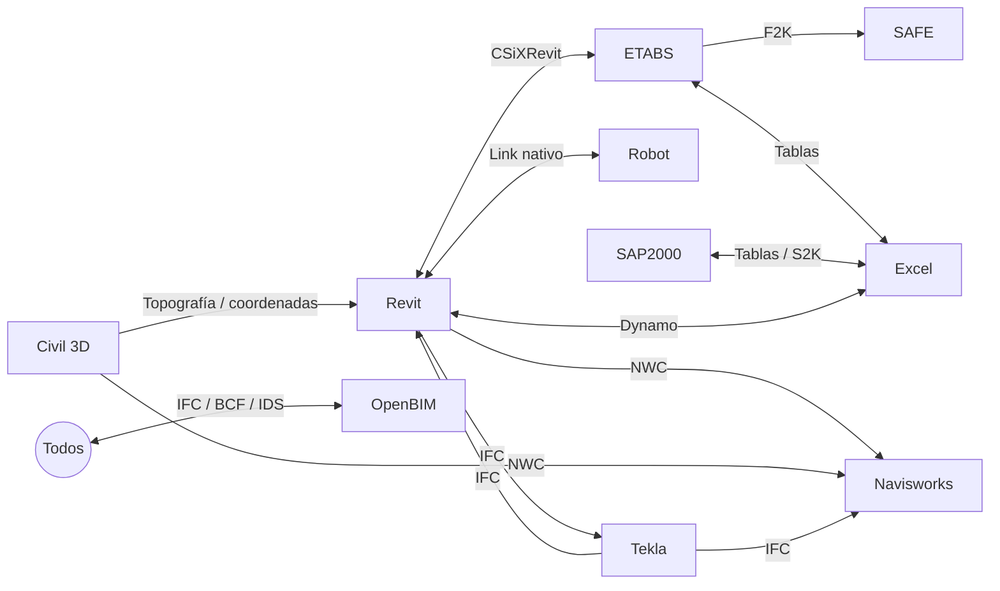

# Interoperabilidad entre software

## Mapa de flujos

| Flujo | Mecanismo | Precauciones |
|---|---|---|
| Revit ↔ ETABS | CSiXRevit (plugin de CSI), IFC, Dynamo + E2K | Revisar modelo analítico, uniones, ejes; secciones mapeadas |
| Revit ↔ Robot | Vínculo nativo (modelo analítico) | Cargas y condiciones de apoyo |
| ETABS → SAFE | Exportación `.F2K` de pisos y cimentación | Actualizar cuando cambian reacciones |
| ETABS/SAP ↔ Excel | Edición interactiva de base de datos / OAPI `DatabaseTables` | Unidades |
| Revit ↔ Tekla | IFC (referencia), plugins de Trimble | GUIDs y conversión de objetos |
| Civil 3D → Revit | Superficies/toposólidos, coordenadas compartidas | Mismo sistema de coordenadas ([[BIM y GIS]]) |
| Todo → Navisworks | NWC/IFC | Unidades, punto base |
| Análisis estructural abierto | [[SAF - Structural Analysis Format]], IFC Structural Analysis View | Soporte variable |
| Hub de datos | [[Speckle]] | Versiones de conectores |

## Regla de oro
Una **prueba de interoperabilidad** en la fase de movilización (ISO 19650-2, 5.5) antes de producir: exportar, importar, comparar y documentar en el [[BEP - Plan de Ejecucion BIM]].

## Rol de JARVIS
JARVIS puede ser **el puente**: leer del software A vía MCP y escribir en el B, con verificación intermedia → [[JARVIS - Flujos de trabajo]].

↑ [[MOC Software AEC]] · [[OpenBIM]]
