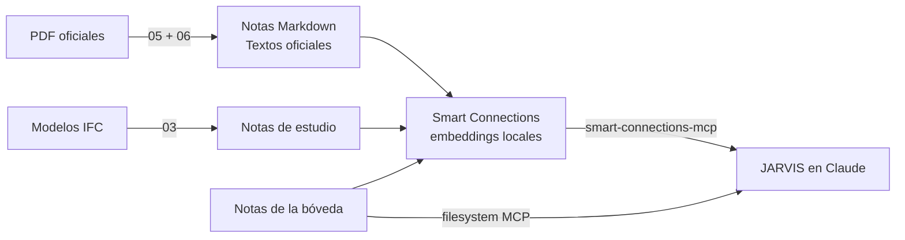

# Activar la red neuronal (Smart Connections + MCP)

Los enlaces `[[...]]` son la red **explícita**. La red **neuronal real** son los **embeddings**: vectores que un modelo de lenguaje local calcula para cada nota y cada bloque, para encontrar notas por **significado**. Se activa en tu PC en unos 15 minutos.



## Paso 1 — Texto dentro de la bóveda
Smart Connections **solo lee Markdown**. Ejecuta en el repositorio:
```powershell
powershell -ExecutionPolicy Bypass -File .\scripts\05_descargar_normas_oficiales.ps1
```
Esto descarga los PDF oficiales (RNE, Plan BIM, Guía Nacional BIM, Ley 32069, DG-2018, metrados, guías ISO 19650, LOD 2025, PxP v3) y crea una nota por norma con un encabezado por artículo → [[Indice de textos oficiales]].

## Paso 2 — Plugins de Obsidian
1. Obsidian → *Configuración → Complementos de la comunidad* → **desactivar modo restringido**.
2. Instalar y activar: **Smart Connections**, **Dataview**, **Templater**, **Local REST API** (opcional: Excalidraw, Obsidian Git, Tasks).

## Paso 3 — Configurar Smart Connections
1. Modelo de embeddings: deja el **modelo local por defecto** (no necesita clave de API; los datos no salen de tu PC).
2. **Excluir** carpetas: `80 PLANTILLAS`, `90 RECURSOS/Adjuntos`.
3. Espera la indexación inicial (la primera vez puede tardar varios minutos con ~300 notas).
4. Abre el panel **Connections**: al abrir una nota verás las más parecidas por significado. Ejemplo: abre [[E.030 - Diseno Sismorresistente]] y deberían aparecer [[E.031 - Aislamiento Sismico]], [[E.050 - Suelos y Cimentaciones]] y el texto oficial de la E.030.

## Paso 4 — Conectar la red a JARVIS (MCP)
En `%APPDATA%\Claude\claude_desktop_config.json` (requiere Node.js 20+), según el README de `smart-connections-mcp`:
```json
"smart-connections": {
  "command": "npx",
  "args": ["-y", "smart-connections-mcp"],
  "env": { "SMART_VAULT_PATH": "C:\\Users\\JHORDAN\\Documents\\1.APP CREADOS\\APP PARA BIM\\ing.jhoel\\JARVIS-BIM" }
}
```
Herramientas que gana JARVIS: búsqueda semántica en la bóveda, notas similares a una nota, estadísticas de la red. Si todavía no hay embeddings, la búsqueda cae a coincidencia de palabras y lo indica.

## Paso 5 — Verificar
- Pregunta a Claude: *"Busca en mi bóveda qué dice la E.030 2026 sobre el periodo del suelo Ts"* → debe citar el artículo 14.
- `python scripts/04_salud_red_neuronal.py` → "SANA".

## Mantenimiento
Cada vez que agregues normas, modelos o proyectos, Smart Connections actualiza los embeddings de las notas nuevas o modificadas.

↑ [[Red neuronal de conocimiento]] · [[MCP Obsidian - Memoria de JARVIS]] · [[MOC JARVIS y MCP]]
