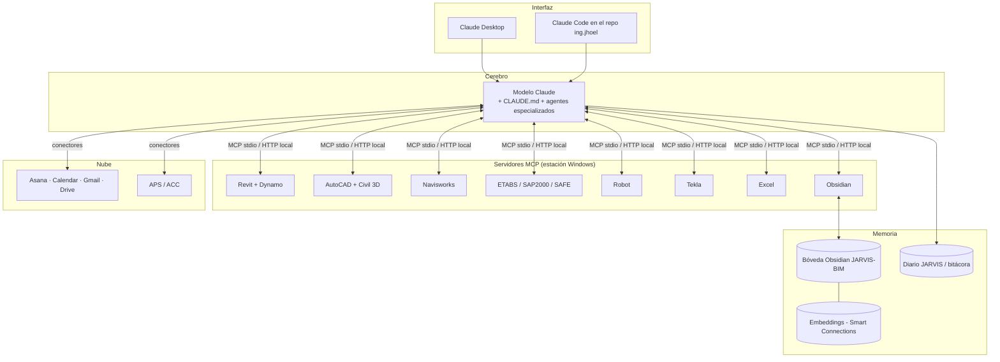

# JARVIS — Arquitectura



## Capas
| Capa | Componentes | Nota |
|---|---|---|
| Interfaz | Claude Desktop (conversación), Claude Code (repo, scripts, agentes) | [[Configuracion de clientes MCP]] |
| Cerebro | Modelo + instrucciones (`CLAUDE.md`) + subagentes | [[JARVIS - Agentes especializados]], [[JARVIS - Biblioteca de prompts]] |
| Memoria | Esta bóveda (conocimiento + proyectos + bitácora) | [[MCP Obsidian - Memoria de JARVIS]], [[Red neuronal de conocimiento]] |
| Herramientas | Un servidor MCP por programa | [[Patrones de puente MCP para software de escritorio]] |
| Aplicaciones | Software AEC instalado y licenciado | [[MOC Software AEC]] |
| Transversal | Seguridad, bitácora, respaldos (git), pruebas | [[JARVIS - Seguridad y gobernanza]], [[JARVIS - Pruebas y evaluacion]] |

## Estructura de carpetas en tu PC
```
C:\Users\JHORDAN\Documents\1.APP CREADOS\APP PARA BIM\
├─ ing.jhoel\                 ← este repositorio (bóveda + scripts + agentes)
│  ├─ JARVIS-BIM\             ← abrir como bóveda en Obsidian
│  ├─ scripts\                ← descarga de modelos, IFC→Obsidian, salud de la red
│  ├─ jarvis\                 ← configuración de clientes MCP
│  └─ .claude\agents\         ← agentes especializados para Claude Code
├─ 02_PROYECTOS_BIM\          ← modelos descargados (IFC, RVT, EDB…)
├─ 03_PROYECTOS_REALES\       ← tus proyectos (fuera de git)
├─ 04_MCP_SERVERS\            ← servidores MCP clonados
└─ 05_RESPALDOS\              ← copias antes de operaciones de escritura
```

## Decisiones de arquitectura
1. **Servidores locales** (stdio) → los modelos nunca salen de tu PC salvo que lo autorices ([[ISO 19650-5 - Seguridad de la informacion]]).
2. **Oficial > comunitario > propio**: usar el MCP del fabricante cuando exista (Revit 2027, Dynamo 4.2); si no, uno comunitario auditado; si no, construir uno propio con la plantilla de [[Patrones de puente MCP para software de escritorio]].
3. **Obsidian como fuente de verdad del conocimiento**, git como respaldo/versionado.

↑ [[MOC JARVIS y MCP]]
