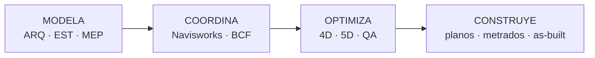

# Proyecto integrador — "Un modelo, 3 disciplinas coordinadas en un flujo BIM"

Plan de práctica basado en el temario de un curso integral de Revit: **Modela → Coordina → Optimiza → Construye**. Objetivo: edificio educativo/comercial de 2 niveles modelado en tres disciplinas, federado y coordinado.

## Módulo 1 — Revit Estructura → [[Revit]] · [[MOC Ingenieria Estructural]]
Modelar con precisión: **columnas, vigas, losas, zapatas, escaleras**.
- [ ] Ejes y niveles compartidos (coordenadas → [[BIM y GIS]])
- [ ] Zapatas y vigas de cimentación (`IfcFooting`)
- [ ] Columnas y vigas de concreto armado (secciones del predimensionamiento)
- [ ] Losas aligeradas/macizas
- [ ] Escaleras
- [ ] Modelo analítico listo para [[ETABS]] / [[Robot Structural Analysis]]

## Módulo 2 — Revit Arquitectura
Espacios funcionales: **muros, puertas, ventanas, pisos y acabados, detalles arquitectónicos**.
- [ ] Muros por tipo (portantes vs tabiques → `LoadBearing`)
- [ ] Puertas y ventanas de [[Bibliotecas de familias BIM]]
- [ ] Pisos, contrapisos y acabados (capas de material)
- [ ] Habitaciones (`IfcSpace`) con áreas
- [ ] Detalles y planos de arquitectura

## Módulo 3 — Revit MEP
Instalaciones **eléctricas y sanitarias coordinadas y sin colisiones**.
- [ ] Instalaciones sanitarias (desagüe por gravedad con pendiente)
- [ ] Redes hidráulicas (agua fría/caliente, tanque elevado)
- [ ] Instalaciones eléctricas (circuitos, tableros)
- [ ] Iluminación
- [ ] Equipos y accesorios

## Módulo 4 — Navisworks y coordinación BIM → [[Navisworks]]
- [ ] Exportar NWC de cada disciplina y federar (NWF) → [[Federacion de modelos]]
- [ ] Matriz de choques EST vs MEP, ARQ vs MEP → [[Coordinacion BIM y deteccion de interferencias]]
- [ ] Reporte + BCF → [[Plantilla - Reporte de interferencias]]
- [ ] Revisión en [[Visores BIM gratuitos]]

## Módulo 5 — Optimiza y construye
- [ ] Secuencia 4D en TimeLiner → [[BIM 4D - Planificacion]]
- [ ] Metrados por partida a Excel → [[BIM 5D - Costos y metrados]]
- [ ] Auditoría con Model Checker y exportación IFC validada con IDS → [[Add-ins recomendados para Revit]], [[IDS - Information Delivery Specification]]
- [ ] Planos en lote y entregables con nomenclatura ISO 19650 → [[Nomenclatura de archivos y contenedores]]

## Documentación del proyecto
Usa [[Plantilla - Proyecto]], [[Plantilla - EIR]] y [[Plantilla - BEP]] como si fuera un encargo real.

## Qué hará JARVIS en este proyecto
Auditar cada disciplina, correr la coordinación semanal, generar metrados y el análisis sísmico → [[JARVIS - Flujos de trabajo]].

↑ [[Ruta de aprendizaje BIM]] · [[Indice de proyectos]]
